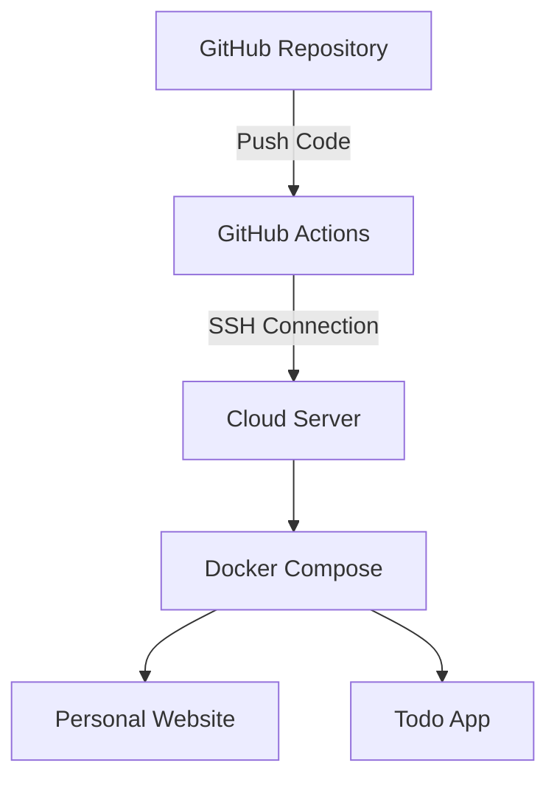

# Final

## Student Information
- **Name:** Tangziyu
- **Student ID:** 20232046
- **Institution:** North Minzu University ✕ Chiang Mai University
## Project Description
This project demonstrates:
- Docker containerization
- CI/CD with GitHub Actions
- Multi-service deployment with Docker Compose

## Access URLs
- Personal Website: http://13.218.144.161:8080
- Todo Application: http://13.218.144.161:8081

## Deployment Architecture

## How to Update
1. Modify files in `personal-website/` folder
2. Commit and push changes
3. GitHub Actions will automatically redeploy